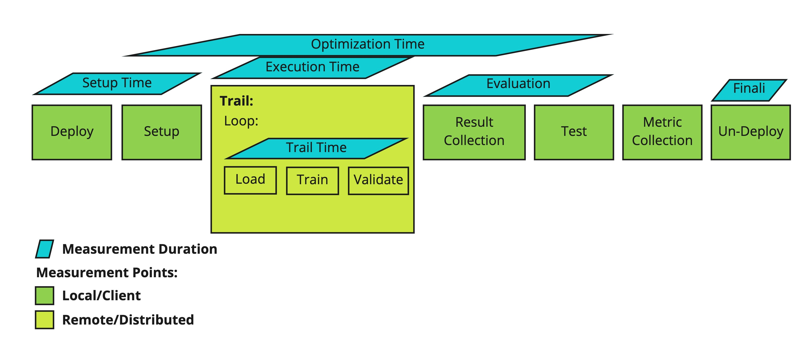

# ml_benchmark
This repository supplies a job to benchmark hyperparameter tuning.

## Start up

### Prerequisites

* Ubuntu >= 16.04 (not tested on MAC OS)
* Python >= 3.7.0
* [PyTorch](https://pytorch.org/get-started/locally/)

Note: If you run your benchmark on GPU make sure to install [Cuda](https://docs.nvidia.com/cuda/cuda-installation-guide-microsoft-windows/index.html) and install the correct PyTorch Version, which fits your Cuda version.

### Install

1. Clone the repository with `git clone <url>`
2. Create a Python environment with `python -m venv .venv`.
3. Activate your environment with `source .venv/bin/activate`
4. Upgrade pip with `pip install pip --upgrade`
5. If not already installed install [PyTorch](https://pytorch.org/get-started/locally/)
6. To install the benchmark and use it locally type, switch to the root_folder of the repository and type in `pip install -e .`

## Class Explanation

|Class|Description|
|---|---|
|MNISTTask|Use it to get the Data for the Model. Please do not change its configuration|
|MLPObjective|The Job that needs to be executed. Adjustments should not be neccessary.|
|MLP|The model that is trained over the MNIST Task.|

# Benchmark Methodolegy

Each implementation uses a common **experiment-docker-container** that represents the full lifecycle of a benchmarking experiment, see the lifecycle figure.

## Lifecycle
The Lifecycle consists of 7 steps, that we describe in detail in the following:
.

|Step|Description|
|----|-----------|
|Deploy|Describes all deployment operations necessary to run the required components of a hyperparameter optimization (HPO) framework to run the HPO task. With the completion of this step the desired architecture of the HPO Framework should be running on a platform, e.g,. in the case of Kubernetes it referes to the steps nassary to deploy all pods and services in kubernetes.|
|Setup| All operations needed to initialize and start a trial. For instance the handover of relevant classes to other workers, or the scheduling of a new worker. |
|Trial| A Trial defines the loading, training and validation of a model with a specific hyperparameter setting. A hyperparameter setting is one combination of hyperparameters, which can be used to initialize a model. E.g.`learning_rate=1e-2` etc.|
|Load| Primarily includes all I/O operations that are needed to provide a Trial with the required data, as well as initializations of the model class, with a certain hyperparameter setting. |
|Train| The training procedure of a model, which computes model parameters to solve a classification or regression problem. Generally training is repeated for a fixed number of epochs.|
|Validate| The trained model has to be validated on a given dataset. Validation captures the performance of a hyperparameter setting of a certain model. The performance of this model on the validation set is later used to find the best hyperparameter setting.|
|Result Collection| The collection of models, classifcation/regression results or other metrics for the problem at hand of each trial. After running of all trials results have to be consolidated for a compairison. Depending on the framework, this step might be a continues process that end once all trails are compleat or a process that is triggered after the framework under test observed the compleation of all trails. However, for this benchmark we allways measure the result collection as the time between the last compleated trail and the identification of the best performing hyperparameter set.|
|Test|The final evaluation of the model which performed the best of all trials on the validation set. The test results are thus the final results for the model with the best hyperparameter setting.|
|Metric Collection| Describes the collection of all gathered Metrics, which are not used by the HPO framework (Latencies, CPU Resources, etc.). This step runs outside of the HPO Framework.|
|Un-Deploy| The clean-up procedure to undeploy all components of the HPO Framework that were deployed in the **Deploy** step.|

The docker container stub is located [here](todo).

# System Components

Adresses all components that perform necessary task in an HPO. E.g. Scheduling, I/O Operations etc.
A component is not necessarily one Object within the framework, but it can be a collection of multiple objects performing similar elemental tasks.
A fair compairison between HPO Frameworks would map all HPO Frameworks into these components and measure their performed tasks against each other.
